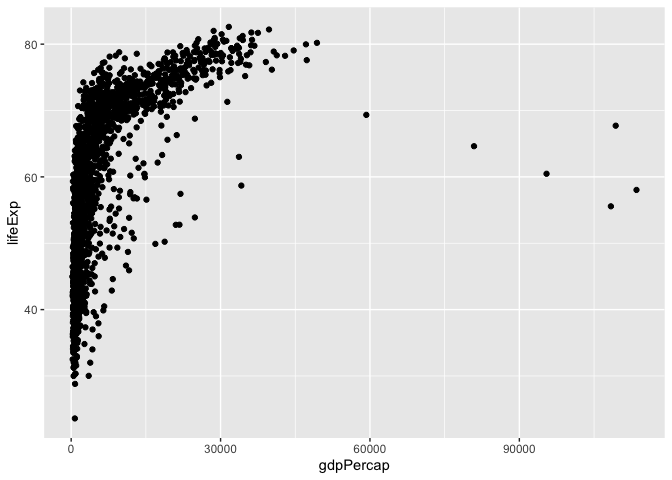

```r
# Setup
myPackages <- c("tidyverse", "broom", "coefplot", "cowplot",
                 "gapminder", "GGally", "ggrepel", "ggridges", "gridExtra",
                 "here", "interplot", "margins", "maps", "mapproj",
                 "mapdata", "MASS", "quantreg", "rlang", "scales",
                 "survey", "srvyr", "viridis", "viridisLite", "devtools")
install.packages(myPackages)
devtools::install_github("kjhealy/socviz")
```

## Chapter 1: Look At Data

**Why look at data?**

* Because numbers can be misleading & describe a variety of patterns that will only come to light when we can see all of the data at once

**Principles of bad figure making**

* "Chart junk": extraneous stuff that doesn't add to the data story
  + In some cases, though, a memorable graph will have a bit of superfluous design if it is clever
* Bad data: the data being presented tell a misleading story
* Problems with perception: the chart may be free of junk, but human visual perception will be misled by the chart's layout or dimensions

**Human Perception**

* Humans are better at seeing gradients when they are all the same hue and chroma but vary in luminance
* Need to be careful with color choice to make sure colors step through the options as intended
  + In other words, colors can be misleading if picked wrong (e.g. one color can unintentionally stand out more than the others)
* Shape and color are two "channels" that can encode information visually about your data
  + Color channel seems to work better than shape channel
  + Should try to avoid showing data through multiple channels
* Gestalt Rules
  + Proximity: things close together seem related
  + Similarity: things that look alike seem related
  + Connection: things visually tied together seem related
  + Continuity: Partially hidden objects are perceptually completed
  + Figure & ground: visual elements seen in either the foreground or the background
  + Common fate: elements moving in the same direction are seen as a unit (e.g. school of fish)

**Decoding Graphs**

* Humans do best when judging the relative position of things on a common scale
* Humans do worst when judging quantities as angles or areas (esp. areas of circles)

**Honest & Good Judgment** 

* Not always good rules of thumb for what is an honest representation
  + Sometimes it makes sense not to start your Y-axis at 0, and if your axes are labeled, not necessarily misleading

## Chapter 2: Getting Started


```r
# Load in libraries
library(tidyverse)
```

```
## ── Attaching packages ───────────────────────────────────────────────────────────────────────── tidyverse 1.3.0 ──
```

```
## ✓ ggplot2 3.3.0     ✓ purrr   0.3.4
## ✓ tibble  3.0.1     ✓ dplyr   0.8.5
## ✓ tidyr   1.1.0     ✓ stringr 1.4.0
## ✓ readr   1.3.1     ✓ forcats 0.5.0
```

```
## ── Conflicts ──────────────────────────────────────────────────────────────────────────── tidyverse_conflicts() ──
## x dplyr::filter() masks stats::filter()
## x dplyr::lag()    masks stats::lag()
```

```r
library(socviz)
```

* Mostly an overview of R & RStudio
* A `tibble` is a tidyverse data.frame


```r
# Tiny data set from socviz package
class(titanic)
```

```
## [1] "data.frame"
```

```r
# Turn titanic into a tidyverse tibble
titanic_tb <- as_tibble(titanic)
titanic_tb
```

```
## # A tibble: 4 x 4
##   fate     sex        n percent
##   <fct>    <fct>  <dbl>   <dbl>
## 1 perished male    1364    62  
## 2 perished female   126     5.7
## 3 survived male     367    16.7
## 4 survived female   344    15.6
```

* The package `haven` is also good for reading in data of various formats
* Apparently "tidy" data is long format rather than wide format
  + **Note**: I am intrigued

### Making my first figure


```r
library(gapminder)
gapminder
```

```
## # A tibble: 1,704 x 6
##    country     continent  year lifeExp      pop gdpPercap
##    <fct>       <fct>     <int>   <dbl>    <int>     <dbl>
##  1 Afghanistan Asia       1952    28.8  8425333      779.
##  2 Afghanistan Asia       1957    30.3  9240934      821.
##  3 Afghanistan Asia       1962    32.0 10267083      853.
##  4 Afghanistan Asia       1967    34.0 11537966      836.
##  5 Afghanistan Asia       1972    36.1 13079460      740.
##  6 Afghanistan Asia       1977    38.4 14880372      786.
##  7 Afghanistan Asia       1982    39.9 12881816      978.
##  8 Afghanistan Asia       1987    40.8 13867957      852.
##  9 Afghanistan Asia       1992    41.7 16317921      649.
## 10 Afghanistan Asia       1997    41.8 22227415      635.
## # … with 1,694 more rows
```

```r
p <- ggplot(data = gapminder,
            mapping = aes(x = gdpPercap, y = lifeExp))
p + geom_point()
```

<!-- -->

# Chapter 3: Make a Plot

## How `ggplot` works

* plot elements called *aesthetic mappings*
* Type of plot is called a *geom*
* `ggplot` is part of the *tidyverse*, so it expects data in long format (where every observation is a row)
* Basic template for a plot:


```r
p <- ggplot(data = <data>,
            mapping = aes(<aesthetic1> = <variable1>,
                          <aesthetic2> = <variable2>))
p <- geom_<type>(<...>) +
     scale_<mapping>_<type>()
```

## Trying out a plot


```r
library(gapminder)
gapminder
```

```
## # A tibble: 1,704 x 6
##    country     continent  year lifeExp      pop gdpPercap
##    <fct>       <fct>     <int>   <dbl>    <int>     <dbl>
##  1 Afghanistan Asia       1952    28.8  8425333      779.
##  2 Afghanistan Asia       1957    30.3  9240934      821.
##  3 Afghanistan Asia       1962    32.0 10267083      853.
##  4 Afghanistan Asia       1967    34.0 11537966      836.
##  5 Afghanistan Asia       1972    36.1 13079460      740.
##  6 Afghanistan Asia       1977    38.4 14880372      786.
##  7 Afghanistan Asia       1982    39.9 12881816      978.
##  8 Afghanistan Asia       1987    40.8 13867957      852.
##  9 Afghanistan Asia       1992    41.7 16317921      649.
## 10 Afghanistan Asia       1997    41.8 22227415      635.
## # … with 1,694 more rows
```

```r
# First tell ggplot() what data we are using
p <- ggplot(data = gapminder)
p <- ggplot(data = gapminder, 
            mapping = aes(x = gdpPercap,
                          y = lifeExp))

# How much info does ggplot() have right now?
str(p)
```

```
## List of 9
##  $ data       : tibble [1,704 × 6] (S3: tbl_df/tbl/data.frame)
##   ..$ country  : Factor w/ 142 levels "Afghanistan",..: 1 1 1 1 1 1 1 1 1 1 ...
##   ..$ continent: Factor w/ 5 levels "Africa","Americas",..: 3 3 3 3 3 3 3 3 3 3 ...
##   ..$ year     : int [1:1704] 1952 1957 1962 1967 1972 1977 1982 1987 1992 1997 ...
##   ..$ lifeExp  : num [1:1704] 28.8 30.3 32 34 36.1 ...
##   ..$ pop      : int [1:1704] 8425333 9240934 10267083 11537966 13079460 14880372 12881816 13867957 16317921 22227415 ...
##   ..$ gdpPercap: num [1:1704] 779 821 853 836 740 ...
##  $ layers     : list()
##  $ scales     :Classes 'ScalesList', 'ggproto', 'gg' <ggproto object: Class ScalesList, gg>
##     add: function
##     clone: function
##     find: function
##     get_scales: function
##     has_scale: function
##     input: function
##     n: function
##     non_position_scales: function
##     scales: NULL
##     super:  <ggproto object: Class ScalesList, gg> 
##  $ mapping    :List of 2
##   ..$ x: language ~gdpPercap
##   .. ..- attr(*, ".Environment")=<environment: R_GlobalEnv> 
##   ..$ y: language ~lifeExp
##   .. ..- attr(*, ".Environment")=<environment: R_GlobalEnv> 
##   ..- attr(*, "class")= chr "uneval"
##  $ theme      : list()
##  $ coordinates:Classes 'CoordCartesian', 'Coord', 'ggproto', 'gg' <ggproto object: Class CoordCartesian, Coord, gg>
##     aspect: function
##     backtransform_range: function
##     clip: on
##     default: TRUE
##     distance: function
##     expand: TRUE
##     is_free: function
##     is_linear: function
##     labels: function
##     limits: list
##     modify_scales: function
##     range: function
##     render_axis_h: function
##     render_axis_v: function
##     render_bg: function
##     render_fg: function
##     setup_data: function
##     setup_layout: function
##     setup_panel_guides: function
##     setup_panel_params: function
##     setup_params: function
##     train_panel_guides: function
##     transform: function
##     super:  <ggproto object: Class CoordCartesian, Coord, gg> 
##  $ facet      :Classes 'FacetNull', 'Facet', 'ggproto', 'gg' <ggproto object: Class FacetNull, Facet, gg>
##     compute_layout: function
##     draw_back: function
##     draw_front: function
##     draw_labels: function
##     draw_panels: function
##     finish_data: function
##     init_scales: function
##     map_data: function
##     params: list
##     setup_data: function
##     setup_params: function
##     shrink: TRUE
##     train_scales: function
##     vars: function
##     super:  <ggproto object: Class FacetNull, Facet, gg> 
##  $ plot_env   :<environment: R_GlobalEnv> 
##  $ labels     :List of 2
##   ..$ x: chr "gdpPercap"
##   ..$ y: chr "lifeExp"
##  - attr(*, "class")= chr [1:2] "gg" "ggplot"
```

* The asethetic mappings indicate with variables in the data will be represented by visual elements 
* However, to draw the plot, you need to add a layer to the plot


```r
p + geom_point()
```

<!-- -->


